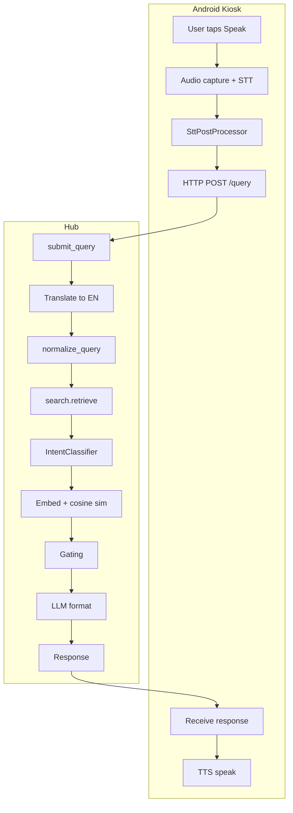

# ResKiosk Pipeline: User Speaks to User Hears Response

For kiosk UI-specific behavior and screen states, see `docs/kiosk-ui.md`.

This document describes the full end-to-end pipeline from the moment the user speaks until they hear the system’s response. All references point to the current codebase. To run the hub, use **TO RUN/start_hub.vbs** (see [GET_STARTED.md](../../GET_STARTED.md)).

---

## Overview



---

## Phase 1: User Starts Speaking (Kiosk)

### 1.1 User taps “Tap to Speak”

The main mic button is in [MainKioskScreen.kt](reskiosk/kiosk/app/src/main/java/com/reskiosk/ui/MainKioskScreen.kt). On click it calls `viewModel.startListening()` when not listening, or `viewModel.stopListening()` when listening.

```522:527:reskiosk/kiosk/app/src/main/java/com/reskiosk/ui/MainKioskScreen.kt
                            onClick = {
                                if (isListening) {
                                    viewModel.stopListening()
                                } else {
                                    viewModel.startListening()
                                }
```

### 1.2 startListening() — TTS bleed fix and recording start

Entry point: [KioskViewModel.kt](reskiosk/kiosk/app/src/main/java/com/reskiosk/viewmodel/KioskViewModel.kt) `startListening()` (lines 243–283).

1. **State check** — Only runs from `Idle`, `Speaking`, `Error`, or `Clarification`; otherwise ignored (lines 247–252).
2. **Stop previous capture and TTS** — `recorder.stopRecording()`, `tts?.stop()` (lines 255–256).
3. **Clear pre-buffer** — `recorder.clearPreBuffer()` so the next recording does not include the last ~1.5 s of TTS from the speaker (line 259). Implemented in [AudioRecorder.kt](reskiosk/kiosk/app/src/main/java/com/reskiosk/audio/AudioRecorder.kt) as a wrapper around `clearRingBuffer()` (lines 76–78).
4. **150 ms delay** — `viewModelScope.launch { delay(150) ... }` so residual speaker output dies down before capture (lines 261–262).
5. **UI and STT** — Set `_uiState = Listening`, clear transcript and `recordedSamples`, call `stt?.beginStream()`, then `recorder.startRecording { chunk -> ... }` (lines 264–282). In the callback, samples are appended to `recordedSamples` and `stt?.feedAndDecodeStream(chunk)` drives live transcript updates (`_transcript`).

### 1.3 Audio capture — ring buffer and STT feed

[AudioRecorder.kt](reskiosk/kiosk/app/src/main/java/com/reskiosk/audio/AudioRecorder.kt):

- **Continuous listening** — `startContinuousListening(coroutineScope)` (lines 86–156) runs a loop on `Dispatchers.IO` that reads from `AudioRecord` into a **ring buffer** (24,000 samples ≈ 1.5 s at 16 kHz) when not in “active STT” mode (lines 33–45, 119–141).
- **startRecording(onData)** (lines 163–183) — Sets `isActivelyRecordingForStt = true`. On the first chunk, the ring buffer is dumped (pre-buffer) and sent to `onData`, then all subsequent live chunks are sent. So the app gets “pre-button-press” audio plus the rest of the utterance.
- **clearPreBuffer()** (lines 76–78) — Clears that ring buffer; used right after TTS stop so the next recording does not include TTS bleed.

---

## Phase 2: User Stops — Process Audio (Kiosk)

### 2.1 User releases button → stopListening()

In [KioskViewModel.kt](reskiosk/kiosk/app/src/main/java/com/reskiosk/viewmodel/KioskViewModel.kt) `stopListening()` (lines 285–296): if state is `Listening`, it calls `recorder.stopRecording()`, sets `_uiState = KioskState.Transcribing`, and calls `processAudio()`. The continuous listener keeps running to refill the ring buffer for the next tap.

### 2.2 processAudio() — all heavy work on background thread

`processAudio()` runs in `viewModelScope.launch(Dispatchers.IO)` so STT and post-processing do not block the UI (lines 316–392).

1. **Copy samples** — `synchronized(recordedSamples) { samples = recordedSamples.toFloatArray() }` (lines 319–322).
2. **Minimum length** — If &lt; 0.3 s, show error and return (lines 326–333). Error is posted with `withContext(Dispatchers.Main) { handleError(...) }`.
3. **Finalize STT** — `transcriptRaw = stt?.finishStream() ?: ""` (line 335). Raw transcript from Sherpa (Zipformer or Whisper).
4. **SttPostProcessor** — `SttPostProcessor.process(transcriptRaw, punctuator)` (lines 346–350). Language determines whether the Zipformer punctuation model is used (`en` or `ja`).

### 2.3 SttPostProcessor — kiosk-side text normalization

[SttPostProcessor.kt](reskiosk/kiosk/app/src/main/java/com/reskiosk/stt/SttPostProcessor.kt) `process(raw, punctuator)` (lines 35–52):

Order of operations:

1. **Lowercase + trim**
2. **Pass A — collapseDuplicates** (lines 55–57) — Regex collapses repeated words (e.g. “where where is the food” → “where is the food”).
3. **Pass B — stripFillers** (lines 59–74) — Removes fillers: “uh”, “um”, “like”, “you know”, etc.
4. **Pass C — applyTimeNormalization** (lines 76–99) — Map of phrases like “seven am” → “7 am”, “twelve noon” → “12 noon”.
5. **Pass D — applyFuzzyDomainCorrection** (lines 101–127) — For words of length ≥ 5, if edit distance to a high-risk domain word (e.g. “registration”, “medical”, “wristband”) is exactly 1, replace with that word. Uses `editDistance()` (standard DP).
6. **Phrase corrections** — Large map of multi-word mishearings (e.g. “medic all station” → “medical station”, “re leaf goods” → “relief goods”). Applied before word corrections (see `applyPhraseCorrections` and `phraseCorrections`).
7. **Word corrections** — Map of single-word fixes (e.g. “agistration” → “registration”). Whole-word replacement with regex boundaries (`applyWordCorrections`, `wordCorrections`).
8. **Punctuation** (if punctuator non-null) — `punctuator.addPunctuation(text)`, then `normalizeCjkPunctuation` for CJK punctuation (Zipformer en/ja only).
9. **toSentenceCase** — Capitalize first character.

Result is `transcriptProcessed`, which is what the user sees and what is sent to the hub.

### 2.4 Intonation and UI update

Still inside `processAudio()` on IO:

- **analyzeIntonation** (lines 360–364) — Uses raw transcript, processed transcript, and audio to derive question vs statement and confidence.
- **withContext(Dispatchers.Main)** (lines 368–385) — Updates `_transcript`, `_uiState = KioskState.Processing`, appends user message and “Asking hub...” placeholder to `_chatHistory`, sets `lastQueryEnglish` / `lastQueryOriginal`, and calls **performQuery(...)** with the processed transcript, placeholder id, and intonation metadata.

---

## Phase 3: Query Sent to Hub (Kiosk → Hub)

### 3.1 performQuery() — network on background thread

[KioskViewModel.kt](reskiosk/kiosk/app/src/main/java/com/reskiosk/viewmodel/KioskViewModel.kt) `performQuery()` (lines 394–475) runs in `viewModelScope.launch(Dispatchers.IO)`.

1. **Hub URL** — From `prefs.getString("hub_url", "")`. If blank, `handleError("Hub not configured...")` on Main and return.
2. **Payload** — Built as a `Map`: `center_id`, `kiosk_id`, `transcript_original`, `transcript_english`, `language`, `kb_version`, `is_retry`, `query_type`, `intonation_confidence`; if clarification retry, `selected_category` and `session_id` are added (lines 407–419).
3. **HTTP call** — `HubApiClient.getService(hubUrl)` then `api.query(payload)` (lines 424–425). Defined in [HubApiClient.kt](reskiosk/kiosk/app/src/main/java/com/reskiosk/network/HubApiClient.kt): `HubApiService` has `suspend fun query(@Body payload: Map<String, Any?>): HubQueryResponse` (lines 29–31). Response type includes `answerTextEn`, `answerTextLocalized`, `answerType`, `clarificationCategories` (lines 15–19).

The call is suspendable and runs on the IO dispatcher, so it does not block the main thread.

---

## Phase 4: Hub Receives Request

### 4.1 POST /query → submit_query()

[hub/api/routes_query.py](reskiosk/hub/api/routes_query.py) — `submit_query(query: QueryRequest, db)` (lines 21–161).

**1. Resolve search text** (lines 25–39)

- `raw_text = (query.transcript_english or query.transcript_original).strip()`
- If `user_language != "en"`, `translator.translate(raw_text, user_language, "en")`; result is `text` (English for search). Else `text = raw_text`.

**2. Hub-side normalizer (for logging)** (line 41)

- `normalized_text = normalize_query(text)` — Used for logging and learning; retrieval uses its own normalizer inside `search.retrieve()`.

**3. Retrieval** (lines 44–59)

- `result = search.retrieve(db, text, query.is_retry, query.selected_category)`.
- On exception, `result` is set to a NO_MATCH-style dict with `intent` and `intent_confidence`.

**4. Optional rewriter** (lines 61–75)

- If `result["answer_type"]` is `NO_MATCH` or `NEEDS_CLARIFICATION`, `query_rewriter.maybe_rewrite(text, result.get("intent"), result["confidence"])` is called.
- [hub/retrieval/rewriter.py](reskiosk/hub/retrieval/rewriter.py) `maybe_rewrite()` (lines 25–63): only runs if `RESKIOSK_QUERY_REWRITE` is true and all of: intent is `"unclear"`, score &lt; 0.40, word count between 4 and 30. Then calls Ollama with a strict “query cleaner” system prompt; if output has &gt; 15 words, returns original query. If the rewritten query differs from `text`, `search.retrieve(db, rewritten, False, None)` is called and its result replaces `result`; `rewrite_applied = 1` for logging.

---

## Phase 5: search.retrieve() — Semantic Search Pipeline

[hub/retrieval/search.py](reskiosk/hub/retrieval/search.py) `retrieve(db, query_english, is_retry, selected_category)` (lines 119–246).

### 5.1 Normalize query

- `normalized_query = normalize_query(query_english)` (line 120).

[hub/retrieval/normalizer.py](reskiosk/hub/retrieval/normalizer.py) `normalize_query(text)` (lines 26–36):

- Lowercase, strip, collapse whitespace (`_WHITESPACE`), collapse duplicate words (`_DUPLICATE_WORD`), apply `_HUB_CORRECTIONS` (e.g. “where where” → “where”, “seven am” → “7 am”), collapse whitespace again. All downstream steps (config match, intent, embedding) use this normalized form.

### 5.2 Direct config match

- `config_match = db.query(schema.StructuredConfig).filter(... key == normalized_query).first()` (lines 123–124).
- If found, return immediately with `answer_type: "DIRECT_MATCH"`, `answer_text` from config, and `intent`/`intent_confidence` set (lines 125–136).

### 5.3 Intent classification

- If `_intent_classifier` is set (at hub startup), `intent, intent_confidence = _intent_classifier.classify(normalized_query)` (lines 138–141).

[hub/retrieval/intent.py](reskiosk/hub/retrieval/intent.py) — **IntentClassifier**:

- Built at startup in [hub/main.py](reskiosk/hub/main.py) `_prewarm_models()` (lines 69–77): `embedder = load_embedder()`, `IntentClassifier(embedder)`, `search_module.set_intent_classifier(intent_classifier)`.
- **IntentClassifier** (lines 115–180): In `__init__`, all phrases in `INTENT_PROTOTYPES` (per intent) are embedded with `embedder.embed_text()`, averaged per intent, L2-normalized → one centroid per intent. `classify(query)` embeds the query, computes dot product with each centroid, returns `(best_intent, best_score)`. If `best_score < 0.30` (UNCLEAR_THRESHOLD), returns `("unclear", best_score)`.

### 5.4 Query enrichment and search query

- `search_query = normalized_query` (line 143).
- If intent is not “unclear” and `intent_confidence >= 0.45` and intent is in `INTENT_ENRICHMENT`, append enrichment keywords: `search_query = f"{normalized_query} {INTENT_ENRICHMENT[intent]}"` (lines 144–146).
- If `is_retry` and `selected_category`, append category: `search_query = f"{search_query} {selected_category}"` (lines 147–148).

### 5.5 Embedding and corpus

- `embedder = load_embedder()` — [hub/retrieval/embedder.py](reskiosk/hub/retrieval/embedder.py): `SecureEmbedder` uses a local SentenceTransformer (MiniLM) at `get_models_path()`; `embed_text(text)` returns a numpy vector (lines 18–31).
- `query_vec = embedder.embed_text(search_query)` (line 151).
- `corpus = _load_corpus(db)` (line 152) — Cached in-memory matrix of article embeddings and plain-dict metadata; built from enabled KB articles with stored embeddings (see `_load_corpus`, `_snapshot_article`, `deserialize_embedding`).
- If corpus is empty, return NO_MATCH with intent fields (lines 154–165).

### 5.6 Similarity and top-k

- `scores = util.cos_sim(query_vec, corpus["matrix"])[0].numpy()` (line 166) — sentence_transformers cosine similarity.
- Top 5 indices: `top_indices = np.argsort(scores)[::-1][:5]` (line 167).
- Build `top_k_results` as list of `RetrievalResult(article_dict, score)` (lines 168–172).
- `best = top_k_results[0]` (line 174).

### 5.7 Clarification gating

- `clarify = needs_clarification(normalized_query, top_k_results, intent, intent_confidence)` only when not `is_retry` (lines 177–183).

[hub/retrieval/search.py](reskiosk/hub/retrieval/search.py) `needs_clarification()` (lines 54–66):

- If intent ≠ “unclear” and intent_confidence ≥ 0.45 → do not clarify.
- If intent is greeting, identity, capability, or small_talk → do not clarify.
- Otherwise, clarify only when intent is “unclear” **and** best retrieval score &lt; CLARIFICATION_FLOOR (0.45). So clarification is asked only for unclear intent with weak retrieval.

### 5.8 Gating and return

- **best.score ≥ THRESHOLD (0.65)** — Return DIRECT_MATCH with `article_data` (title, body, category, tags) for LLM formatting (lines 185–210).
- **best.score ≥ CLARIFICATION_FLOOR (0.45) and clarify** — Return NEEDS_CLARIFICATION with `clarification_categories` (lines 213–218).
- **best.score ≥ CLARIFICATION_FLOOR but not clarify** — Return DIRECT_MATCH (use best article as-is) (lines 221–236).
- **Else** — Return NO_MATCH with fixed fallback text: “I’m not sure. Please approach the volunteer desk for help.” (lines 238–246).

Every return dict includes `intent` and `intent_confidence` for logging and the optional rewriter.

For **non-English queries** (e.g., Spanish "Comida que se sirve"), the same retrieval and gating logic is used after the hub has translated the text to English in `routes_query.submit_query()`. An `answer_type` of `NO_MATCH` in the hub logs means:

- NLLB translation and MiniLM retrieval ran successfully, **but** the best similarity score fell below `CLARIFICATION_FLOOR` (or the corpus/embeddings were unavailable), so the system returned the fixed fallback answer rather than guessing.
- The kiosk still receives a valid response (`answer_type="NO_MATCH"`, generic fallback text), which is then spoken in the user’s selected language via NLLB + TTS.

---

## Phase 6: Hub Response Assembly and Logging

Back in [hub/api/routes_query.py](reskiosk/hub/api/routes_query.py).

### 6.1 Format answer (lines 79–99)

- **DIRECT_MATCH with article_data** — `formatter.format_response(article_json, text, history_str)` on a thread pool. [hub/retrieval/formatter.py](reskiosk/hub/retrieval/formatter.py) `format_response()` (lines 80–131): sends KB JSON + optional history + user question to Ollama with FORMAT_SYSTEM_PROMPT (reformat only, 2–4 sentences, no new content). Returns formatted string or falls back to article body.
- **NEEDS_CLARIFICATION** — `answer_text = result["answer_text"]` (“Please clarify.”).
- **NO_MATCH** — `answer_text = result["answer_text"]` (fixed fallback string).

### 6.2 Translate response (lines 104–112)

- If `user_language != "en"`, `translator.translate(answer_text, "en", user_language)` → `answer_text_localized`. Client can show this instead of English.

### 6.3 Logging (lines 114–143)

- **QueryLog** — One row per query: `session_id`, `kiosk_id`, `transcript_original`, `transcript_english`, `raw_transcript`, `normalized_transcript`, `language`, `kb_version`, `intent`, `intent_confidence`, `retrieval_score`, `answer_type`, `selected_clarification`, `rewrite_applied`, `latency_ms`. Schema in [hub/db/schema.py](reskiosk/hub/db/schema.py) (QueryLog, lines 50–68).
- **ClarificationResolution** — When `query.is_retry` and `query.selected_category`, insert a row: `session_id`, `raw_transcript`, `resolved_intent` (selected category), `language`. Used for learning (which transcript led to which confirmed intent). Schema (lines 71–79).

### 6.4 Session history and response (lines 145–161)

- Append `{"user": text, "assistant": answer_text}` to `session_history[query.session_id]`.
- Return `api_models.QueryResponse`: `answer_text_en`, `answer_text_localized`, `answer_type`, `confidence`, `kb_version`, `source_id`, `clarification_categories`. Defined in [hub/models/api_models.py](reskiosk/hub/models/api_models.py) (QueryResponse, lines 73–80).

---

## Phase 7: Kiosk Receives Response and Speaks

Back in [KioskViewModel.kt](reskiosk/kiosk/app/src/main/java/com/reskiosk/viewmodel/KioskViewModel.kt) `performQuery()`.

### 7.1 withContext(Dispatchers.Main) — UI and TTS

After `api.query(payload)` returns (lines 427–428), all UI and TTS updates run in `withContext(Dispatchers.Main)` (lines 428–458).

**If NEEDS_CLARIFICATION** (lines 429–439):

- Remove the “Asking hub...” placeholder from chat.
- Set `_uiState = KioskState.Clarification(question, response.clarificationCategories)` with question “Which category are you asking?”.
- `tts?.speak(clarificationQuestion)`.
- `resetInactivityTimer()`.

**Else** (lines 440–457):

- `finalAnswer = response.answerTextLocalized ?: response.answerTextEn ?: "I'm sorry, I couldn't find an answer."`
- Replace placeholder with `ChatMessage(isUser = false, text = finalAnswer)` or append user + assistant messages if no placeholder.
- Call **speakAndShow(finalAnswer)**.

### 7.2 speakAndShow() — TTS and return to Idle

`speakAndShow(text)` (lines 499–515):

- Sets `_uiState = KioskState.Speaking(text)` and `tts?.speak(text)`.
- Launches a coroutine that waits for TTS to finish: short initial delay, then `while (tts?.isPlaying() == true)` with 300 ms polling and a 30 s timeout. After speech ends, a short delay then `_uiState = KioskState.Idle` and `resetInactivityTimer()`.

So the user hears the response via the device TTS (Sherpa TTS engine), and when playback finishes the app returns to Idle so they can tap Speak again.

### 7.3 Clarification retry path

If the user was in Clarification and taps a category, [MainKioskScreen.kt](reskiosk/kiosk/app/src/main/java/com/reskiosk/ui/MainKioskScreen.kt) calls `viewModel.selectClarification(option)`. In the ViewModel, `selectClarification(category)` (lines 297–312) calls `performQuery(lastQueryEnglish, lastQueryOriginal, isRetry = true, category = category)`. The hub then runs retrieval again with the same transcript plus the selected category (enrichment in `search.retrieve()`), and the response is spoken as above.

---

## Semantic search tuning guide

This section summarizes the recommended configuration and how to use logs to tune multilingual semantic search. It corresponds to the `optimize-semantic-search-multilingual` plan.

### Recommended defaults

- **Embedder**: MiniLM-L6-v2 via `SecureEmbedder` (current `hub/retrieval/embedder.py` behavior).
- **Thresholds** (can be overridden by environment variables):
  - `RESKIOSK_SIM_THRESHOLD` (DIRECT_MATCH gate): **0.60**
  - `RESKIOSK_CLARIFICATION_FLOOR` (clarification / fallback floor): **0.40**
- **Query normalization**:
  - Kiosk-side: `SttPostProcessor.process()` (handles fillers, fuzzy domain words, and phrase corrections).
  - Hub-side: `hub/retrieval/normalizer.normalize_query()` (lowercase, deduplicate, time normalization, domain-specific phrasing fixes such as “where is food being served” → “where is food served”).
- **Intent enrichment**:
  - `INTENT_ENRICHMENT` in `hub/retrieval/search.py` includes realistic language for core intents such as food, registration, medical, and sleeping so that MiniLM sees both KB wording and typical user phrasings in the search query.

### How to collect retrieval scores from logs

1. Run the hub and kiosk against a real or test KB so queries are logged.
2. For each test question (English or non-English), look for the following in the hub logs:
   - `[Query] Incoming: lang=... raw='...'`
   - `[Query] Inbound translated (...->en): '...'`
   - `[Retrieve] query='...'`
   - `[Search] #1 score=... title='...' cat=...`
   - Final `answer_type` and `confidence` in the QueryLog row (see `hub/db/schema.py`).
3. Record for each query:
   - Original text and language.
   - Translated English text.
   - Top article title and category.
   - Best similarity score.
   - `answer_type` (`DIRECT_MATCH`, `NEEDS_CLARIFICATION`, or `NO_MATCH`).
4. Classify misses using the plan’s rubric:
   - **T1** — Translation odd but still on-topic.
   - **T2** — Translation OK but score too low despite a good article.
   - **T3** — No strong article (KB content gap).

Use these observations to decide whether to:

- Adjust KB wording (titles, bodies, tags) for important intents so they better match how people actually ask questions.
- Further tweak `RESKIOSK_SIM_THRESHOLD` / `RESKIOSK_CLARIFICATION_FLOOR` via environment variables.
- Extend `INTENT_ENRICHMENT` and `_HUB_CORRECTIONS` if NLLB consistently prefers certain synonyms.

### KB authoring tips for better retrieval

When editing KB articles in the admin UI:

- **Titles**: Include question-like phrases users actually say, e.g., “Where is food being served?” instead of only “Food schedule”.
- **Bodies**: Start with 1–2 concise sentences that restate the question in natural language before giving the answer.
- **Tags**: Add key nouns and phrases surfaced in logs (e.g., `food, meals, canteen, cafeteria, registration table`).

Because all non-English queries are translated to English before retrieval, optimizing the **English KB content and thresholds** improves behavior for every supported language.

---

## Summary Table

| Stage | Location | Key function / component |
|-------|----------|---------------------------|
| Tap Speak | MainKioskScreen.kt | Button onClick → startListening() |
| TTS stop + pre-buffer clear | KioskViewModel.kt, AudioRecorder.kt | clearPreBuffer(), delay(150), startRecording() |
| Audio capture | AudioRecorder.kt | Ring buffer, startRecording callback, feedAndDecodeStream() |
| Release → process | KioskViewModel.kt | stopListening() → processAudio() on Dispatchers.IO |
| STT finalize | KioskViewModel.kt | stt?.finishStream() |
| Text correction | SttPostProcessor.kt | process(): collapseDuplicates, stripFillers, time norm, fuzzy domain, phrase/word maps, punctuation, toSentenceCase |
| Intonation | KioskViewModel.kt | analyzeIntonation() |
| Send to hub | KioskViewModel.kt, HubApiClient.kt | performQuery() on IO, api.query(payload) |
| Hub entry | routes_query.py | submit_query(): translate, normalize_query (logging), search.retrieve() |
| Optional rewrite | rewriter.py, routes_query.py | maybe_rewrite(), retry retrieve() |
| Retrieve | search.py | normalize_query → config match → intent → enrich → embed → corpus → cos_sim → needs_clarification → gating |
| Intent | intent.py, main.py | IntentClassifier(embedder), classify(), set_intent_classifier() |
| Embedding | embedder.py, search.py | load_embedder(), embed_text(), _load_corpus() |
| Format answer | formatter.py, routes_query.py | format_response() for DIRECT_MATCH with article_data |
| Translate response | routes_query.py | translator.translate() → answer_text_localized |
| Logging | routes_query.py, schema.py | QueryLog, ClarificationResolution |
| Response to kiosk | HubApiClient.kt, KioskViewModel.kt | HubQueryResponse → performQuery() withContext(Main) |
| Clarification UI | KioskViewModel.kt | NEEDS_CLARIFICATION → Clarification state, tts.speak(question) |
| Speak answer | KioskViewModel.kt | speakAndShow(finalAnswer) → TTS, then Idle |

---

## File Reference Index

- **Kiosk (Android)**  
  - [MainKioskScreen.kt](reskiosk/kiosk/app/src/main/java/com/reskiosk/ui/MainKioskScreen.kt) — UI, Speak button, clarification buttons.  
  - [KioskViewModel.kt](reskiosk/kiosk/app/src/main/java/com/reskiosk/viewmodel/KioskViewModel.kt) — startListening, stopListening, processAudio, performQuery, speakAndShow, handleError.  
  - [AudioRecorder.kt](reskiosk/kiosk/app/src/main/java/com/reskiosk/audio/AudioRecorder.kt) — Ring buffer, clearPreBuffer, startRecording, continuous listening.  
  - [SttPostProcessor.kt](reskiosk/kiosk/app/src/main/java/com/reskiosk/stt/SttPostProcessor.kt) — process(), all correction passes.  
  - [HubApiClient.kt](reskiosk/kiosk/app/src/main/java/com/reskiosk/network/HubApiClient.kt) — HubApiService.query(), HubQueryResponse.

- **Hub (Python)**  
  - [hub/api/routes_query.py](reskiosk/hub/api/routes_query.py) — submit_query, logging, rewriter retry.  
  - [hub/retrieval/search.py](reskiosk/hub/retrieval/search.py) — retrieve(), needs_clarification(), INTENT_ENRICHMENT, thresholds.  
  - [hub/retrieval/normalizer.py](reskiosk/hub/retrieval/normalizer.py) — normalize_query().  
  - [hub/retrieval/intent.py](reskiosk/hub/retrieval/intent.py) — IntentClassifier, INTENT_PROTOTYPES.  
  - [hub/retrieval/embedder.py](reskiosk/hub/retrieval/embedder.py) — SecureEmbedder, load_embedder(), embed_text().  
  - [hub/retrieval/rewriter.py](reskiosk/hub/retrieval/rewriter.py) — maybe_rewrite().  
  - [hub/retrieval/formatter.py](reskiosk/hub/retrieval/formatter.py) — format_response().  
  - [hub/db/schema.py](reskiosk/hub/db/schema.py) — QueryLog, ClarificationResolution.  
  - [hub/models/api_models.py](reskiosk/hub/models/api_models.py) — QueryRequest, QueryResponse.  
  - [hub/main.py](reskiosk/hub/main.py) — _prewarm_models(), IntentClassifier init.
